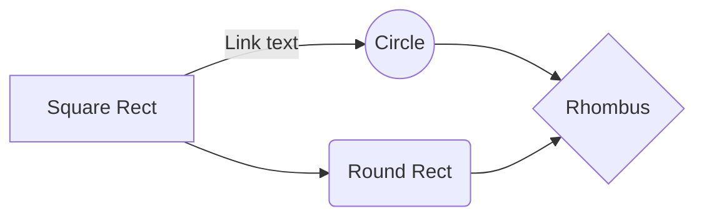

# This is a header.
Here are some sample text.
_also in italic_

And this will produce a flow chart:

```mermaid
graph LR
A[Square Rect] -- Link text --> B((Circle))
A --> C(Round Rect)
B --> D{Rhombus}
C --> D
```

 

[Google!](www.google.com)
